<h1 align=center> Modern DevOps Practices on IBMi</h1>

- [Initial Setup](#initial-setup)
  - [1. Connect to IBMI from VS Code](#1-connect-to-ibmi-from-vs-code)
  - [2. Set Shell to BASH](#2-set-shell-to-bash)
  - [3. Set Open Source path variables](#3-set-open-source-path-variables)
- [Install GIT](#install-git)
- [Setup GITHUB](#setup-github)
- [Setup Jenkins](#setup-jenkins)
- [Setup PM2](#setup-pm2)
  - [Install PM2](#install-pm2)
  - [Configure PM2](#configure-pm2)
- [Install GitLab on IBMi](#install-gitlab-on-ibmi)
- [Install GitBucket on IBMi](#install-gitbucket-on-ibmi)
- [Footnotes/References](#footnotesreferences)
- [Gmake or BOB?](#gmake-or-bob)
- [Test Cases](#test-cases)
- [Further Research](#further-research)

---


# Initial Setup

1. [Connect to IBMI from VS Code](#connect-to-ibmi-from-vs-code) - *because, it is easy to execute shell commands and edit IFS files in VS Code!*
2. [Set Shell to BASH](#set-shell-to-bash) - *because, the default shell is very limiting and irritating!*
3. [Set Open Source Path Variables](#set-open-source-path-variables) - *because, we need to tell the IBMI where to locate the open source linux commands.*

## 1. Connect to IBMI from VS Code
- Connect to IBMI via VS Code. You should knew that now already. If not, check [this](https://github.com/Programmersio-IBMi/vscode-integration/blob/main/README.md) link and come back here once you have connected your IBMi.  
- Enter `Ctrl + Shift + J` once connected to the IBM I via VS Code and select **PASE** terminal.


## 2. Set Shell to BASH
Either set it via VS Code. 
  
  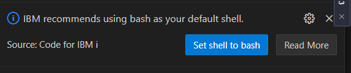
  

  **<p align="center">OR</p>**
  
Enter the below command in the PASE terminal. *Don't forget to ==replace username==*
  ```bash
  /QOpenSys/pkgs/bin/chsh -s /QOpenSys/pkgs/bin/bash username
  ```

## 3. Set Open Source path variables
In order to be able to run the linux commands without specifying the location of the command, we have to setup the Open Source Path Variables. Do the below steps to do so.
- Navigate to your home folder by entering `cd ~`
- Create a new file called `.profile` in your home folder by issuing the command `touch .profile`
- Open the file `.profile` using VS Code's IFS Browser
  
  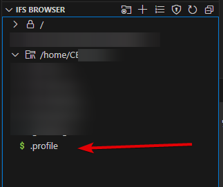
- Copy paste the below content on the `.profile` file. 
*Note: The numbers are listed to explain the commands. Don't copy the numbers*
```bash
1: PATH=/QOpenSys/pkgs/bin:$PATH
2: export PATH PASE_PATH
3: export JAVA_HOME=/QOpenSys/QIBM/ProdData/JavaVM/jdk17/64bit
4: export JENKINS_HOME=/home/CECUSER/jenk
```
>1: The open source linux commands are available in the path `/QOpenSys/pkgs/bin`, so we are appending that location to the already available path variable. 
>2: Exporting the changes to the system.
>3: The default JAVA version in IBMi sometimes would be 8. But Jenkins require version 11 and above. So we will tell IBMi to use the latest version of JAVA (17 in our case) while running Jenkins.
>4: We are setting up the Jenkins' home folder on a folder called 'jenk'. It provides better management of application folder, and even the whole application can be uprooted and planted in another location if required. 

- **Disconnect the IBMI and reconnect again for these setup to take effect.**
- Once connected, open up the PASE terminal again. If the shell is set to bash successfully, you should see the below screen
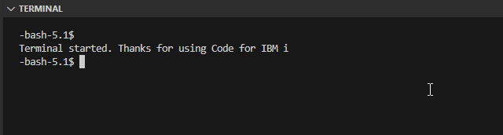

---


# Install GIT 
 


Enter the command below in your PASE terminal.
`yum install git`

---


# Setup GITHUB
**Setup the user name and email for your local git**
  ```bash
  git config --global user.name 'Ravisankar Pandian' #To add a user name for the git application.

  git config --global user.email ravisankar.pandian@programmers.io #To add email for the git application 
  ```
**Generate a public/private keypair.**
 Enter the below command in your PASE terminal. (make sure to enter the email id that you use in your github account)
   `ssh-keygen -t ed25519 -C "ravisankar.pandian@programmers.io"`
- Hit enter again to save the key pair at the default location itself. 
- Hit enter again (no passphrase is required)
- Notice the location of the public key and open it in your VS Code. 
 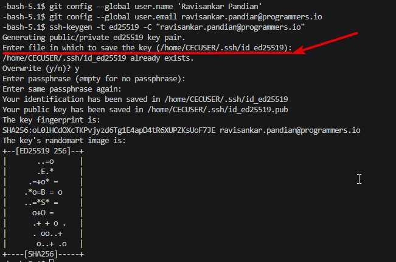

**Copy the public key**
- Navigate to the same folder in your VS Code as below and open the public key
  
  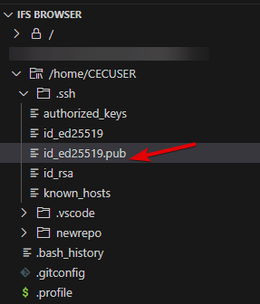
- Copy all the contents of the file. We need to put that into our GitHub account.
  
**Create New SSH Key in your remote repository**
- Open https://github.com/settings/keys and click 'New SSH Key'. 
- Enter some title, Select the key type as "authentication key", paste the previously copied public key, and finally select 'Add SSH Key"
  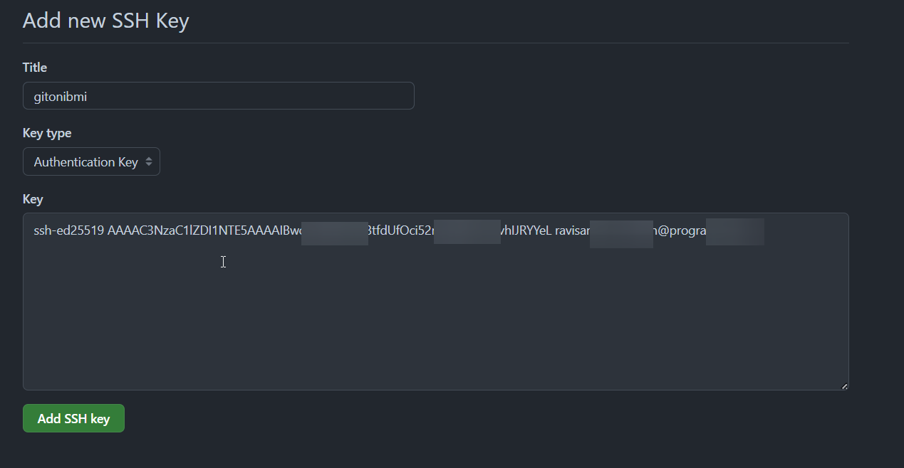
- Once added, you should see the below screen
  

**Connect to the remote repository**
- Now it is time for us to connect to a remote repo. I have setup a GitHub repository called *'gitlearn'* for this experiment and I am going to clone that. 

- You can create your own repo in your github account and copy the command to clone via SSH as below.
  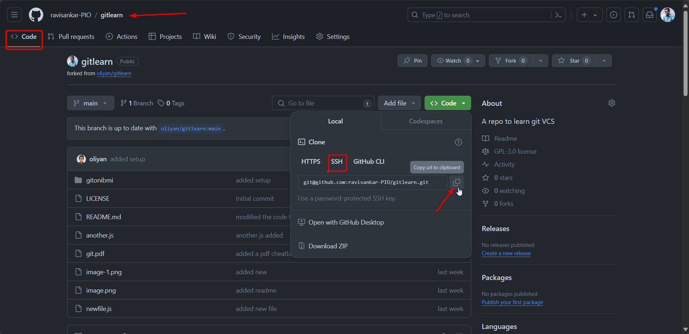

- FYI: This is the command that I just copied
`git@github.com:ravisankar-PIO/gitlearn.git`

- Go to the PASE Terminal and enter
`git clone git@github.com:ravisankar-PIO/gitlearn.git`
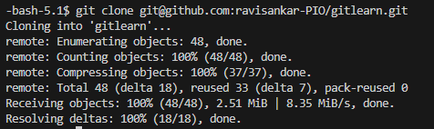

---


# Setup Jenkins

**Download the Jenkins installation JAR file first**
Run the below commands in your PASE terminal
```bash
cd ~ 
wget http://mirrors.jenkins.io/war-stable/latest/jenkins.war
```

**Start Jenkins using the Java Command**
Jenkins can be started by using JAVA command. 
Notice that I am using the port# 7594
```bash
java -jar jenkins.war --httpPort=7594
```
Copy the password to your clipboard to use it later. 
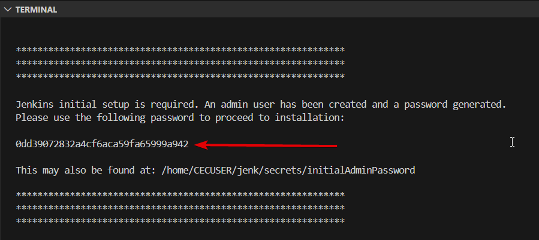


**Jenkins initial setup in browser**
Head over to the browser and type in the IP address of the IBM followed by `:7594`. In my case, it is `http://129.40.94.33:7594/`. Paste the admin password that we just copied a while ago.
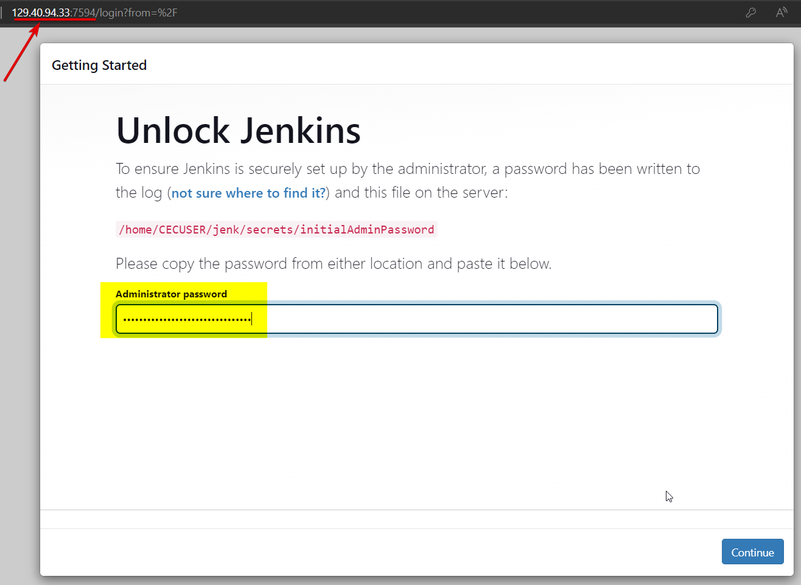

Remember to select "Install suggested plugins"
>Note: It will take some time to load the next screen. Don't click more than once, as it might end up in error. 
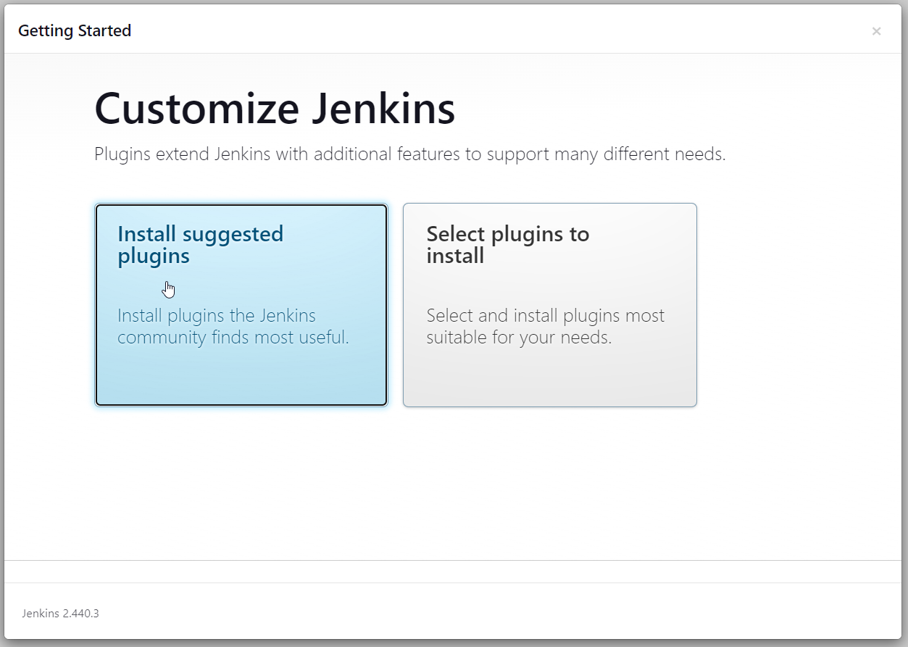
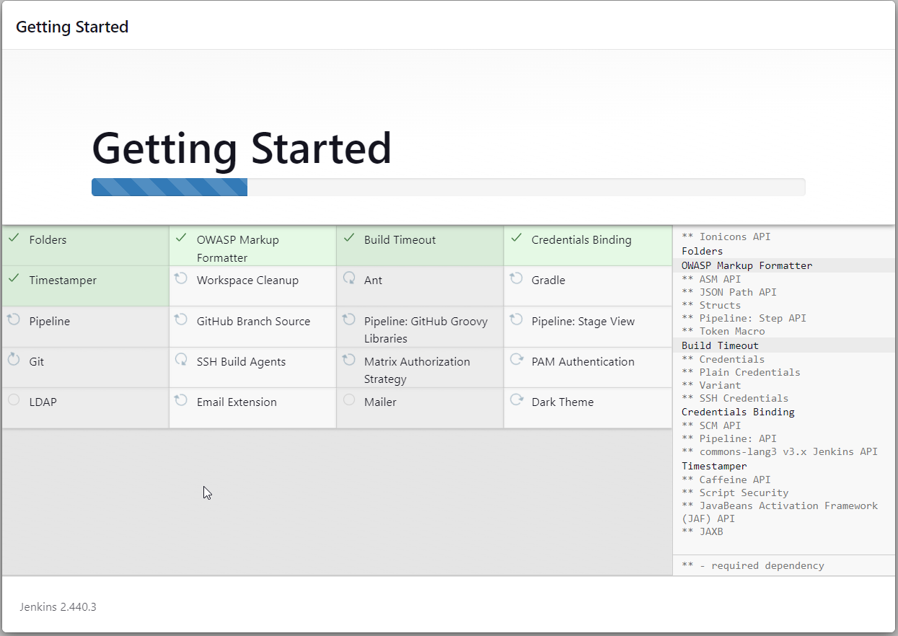

Let's create an Admin user which will be used to login to the Jenkins app from now on. 

UserName: ravi
Password: welcome
Email: ravisankar.pandian@programmers.io
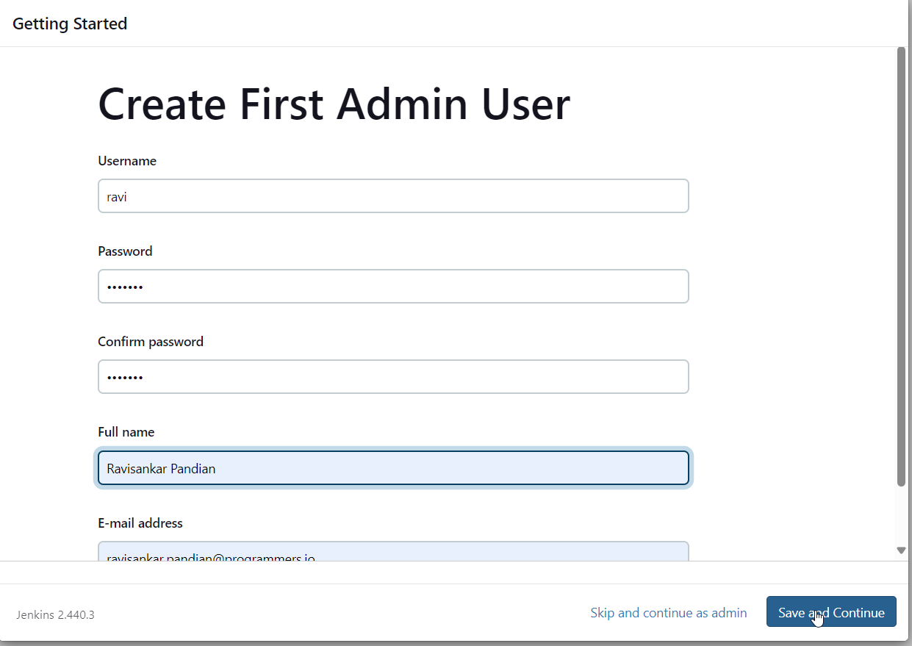


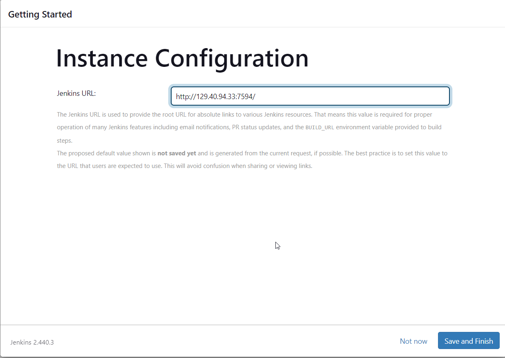

```

```


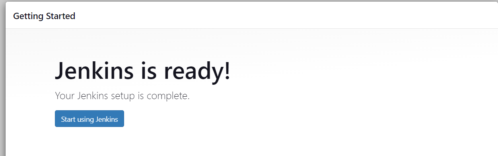


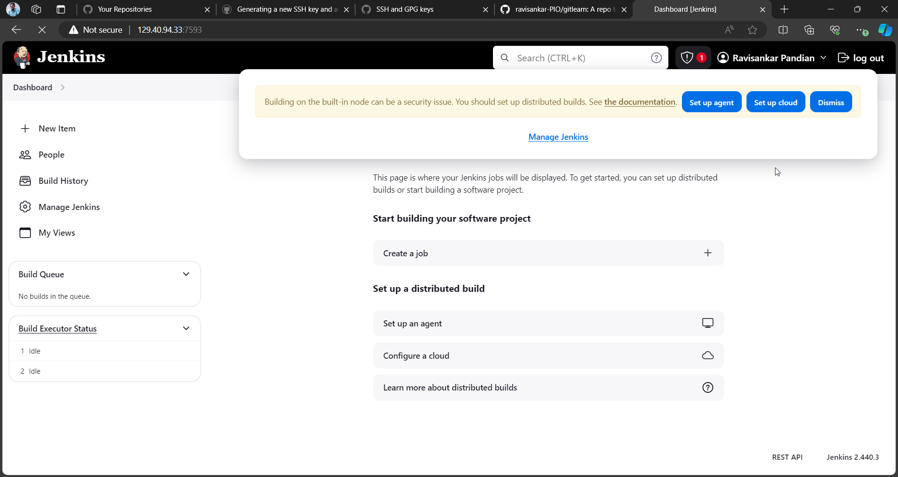

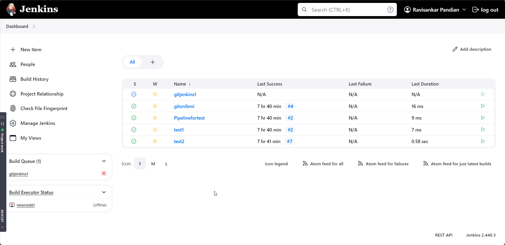

a new file should be created for every build
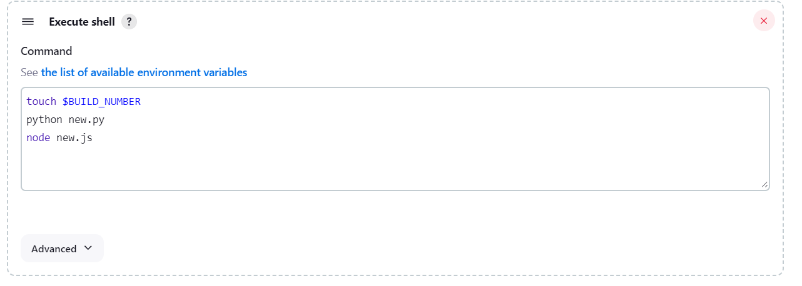

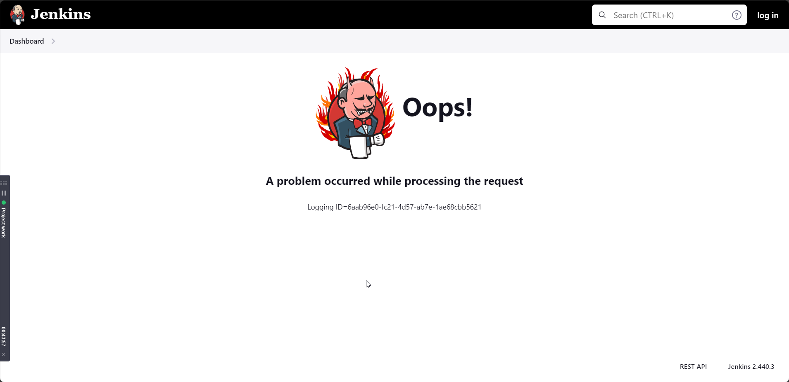

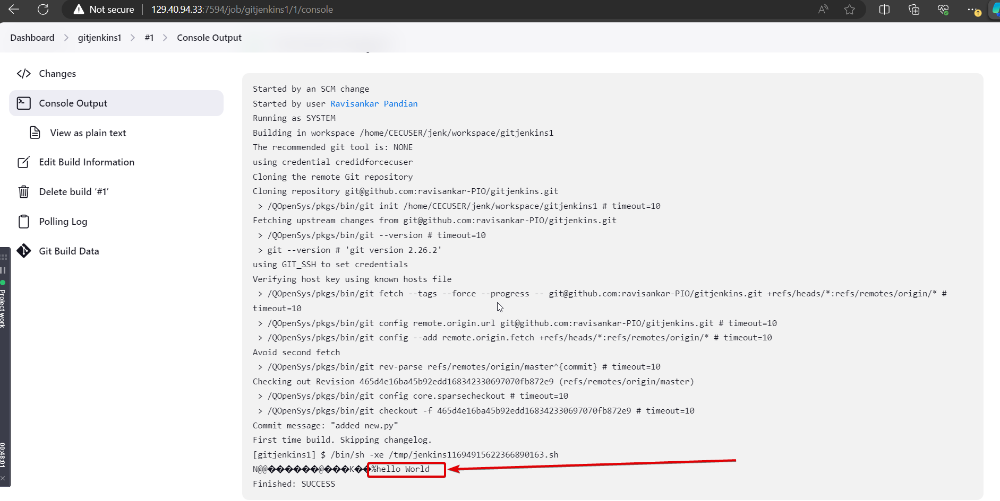

files got created in the workspace directory
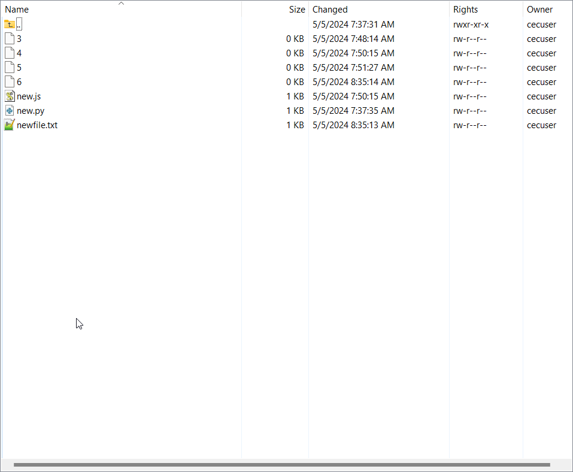

----


Start SSH agent eval $(ssh-agent -s)
Add SSh key to SSH agent ssh-add ~/.ssh/id_rsa.
Add github/gitlab to known host `ssh-keyscan github.com >> ~/.ssh/known_hosts`

---


# Setup PM2
PM2 is a process management app (built on Node.js) which is like an enhanced Task Manager for IBMi. It will be used to autostart, keep the node.js & java based apps persistent.

## Install PM2
- Kill the Jenkins app first
Enter `Ctrl+c` two times on the PASE terminal to kill the currently launched Jenkins' instance.
- Install NodeJS =>  `yum install nodejs14`

- Then install PM2 =>  `npm install pm2@latest -g`

- Add the location of the nodejs's binary to the path
  - Open the .profile file and add a new location to include in path
  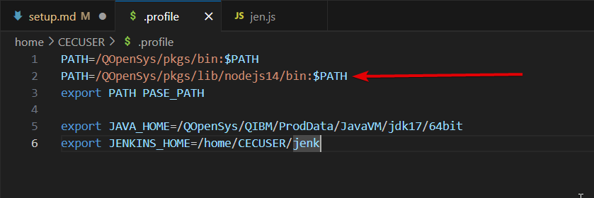
  - Save and close the `.profile` file. Disconnect from IBMi and connect again (for the changes to take effect).

## Configure PM2
- Create a new file called `jen.json` in your home folder. This will be used to start the Jenkins app.
  `touch jen.json`
- Paste this content into that file as below.
```json
  {
  "apps":[
  {
      "name":"jenkins",
      "cwd":".",
      "script":"/QOpenSys/usr/bin/java",
      "args":[
          "-jar",
          "jenkins.war",
          "--httpPort=7594"
      ],
      "exec_interpreter":"",
      "exec_mode":"fork"
   }
 ]
}
```
- Run this command to start the Jenkins => `pm2 start jen.json`

______________


# Install GitLab on IBMi
yum install -y curl policycoreutils-python openssh-server perl

https://packages.gitlab.com/install/repositories/gitlab/gitlab-ee/script.rpm.sh
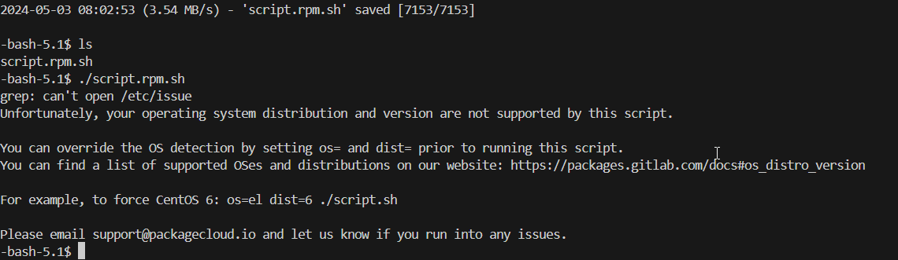

---

# Install GitBucket on IBMi
Gitbucket is a JAVA based SCM tool which can be run on IBMi.


**Download the GitBucket installation JAR file first**
Run the below commands in your PASE terminal
```bash
cd ~ 
wget https://github.com/gitbucket/gitbucket/releases/download/4.40.0/gitbucket.war
```

**Start GitBucket using the Java Command**
GitBucket can be started by using JAVA command. 
*Notice the port number **8081***
```bash
java -jar gitbucket.war --port=8081
```


---
# Footnotes/References

- Jenkins 
  - Refer [this](https://github.com/worksofliam/blog/issues/4), [this](https://pm2.keymetrics.io/docs/usage/quick-start/) and [this](https://www.youtube.com/watch?v=0O2Nz5duuzg) link to automate Jenkins using PM2.

  - [Getting started](https://devopscube.com/jenkins-2-tutorials-getting-started-guide/) with Jenkins.
  - Create Jenkins [pipeline](https://www.jenkins.io/doc/pipeline/tour/hello-world/)
  - [setup Jenkins](https://github.com/worksofliam/blog/issues/43) on IBMi

- Gitlab
  - [dependencies for GitLab](https://archlinux.org/packages/extra/x86_64/gitlab/)
  - [CICD Script to connect GitLab with IBMI](https://gitlab.com/JDubbTX/IBMiExamples/-/blob/main/.gitlab-ci.yml?ref_type=heads)
  - https://docs.gitlab.com/ee/install/install_methods.html
  - https://docs.gitlab.com/ee/install/installation.html
- GitBucket 
  - A VCS that can be hosted within IBMi. Click [here](https://github.com/gitbucket/gitbucket/wiki) to learn more.
- Source Orbit
  - Defintion of [Source Orbit](https://ibm.github.io/sourceorbit/#/) - a dependency management system
  - A [blog post](https://github.com/worksofliam/blog/issues/66) by Liam Barry that tells about the SO - SourceOrbit.
- IBMi - CI
  - A built in CI tool within IBMi. See it in action [here](https://www.youtube.com/watch?v=t-9nOyBjjCU)
  - Learn more about [IBMi-CI](https://github.com/IBM/ibmi-ci)

- Click [here](https://ibmi-oss-docs.readthedocs.io/en/latest/yum/3RD_PARTY_REPOS.html) to view about the third party Repos for IBMI


[Main Cook book](https://pixerenet1.sharepoint.com/:w:/r/sites/ProgrammersIO/_layouts/15/Doc.aspx?sourcedoc=%7BC6BB8D56-3508-48C7-BA9F-0976B312D379%7D&file=ci_cd_ibmi_Ashish%20(InProcess).docx&action=default&mobileredirect=true) - follow this for clarity - A guide by Ashish


[PIO's guide for OSSonIBMi](https://github.com/Programmersio-IBMi/OSSonIBMi)

[rpg-git-book](https://github.com/worksofliam/rpg-git-book/blob/main/4-repository-host.md) - This is an excellent starting point for moving to GIT

---
# Gmake or BOB?
*Following [this](https://ibm.github.io/ibmi-bob/#/getting-started/installation) article for BOB*

1. Install IBMi Repos =>   `yum install ibmi-repos`
2. Install BOB => `yum install bob`
faced an error

3. update yum packages => `yum update` and try again to install bob
4. Bob installed successfully
5. Let's test the build command by cloning a git repo.
   1. Create a library to save the build into
    `system "CRTLIB LIB(BOBTEST) TEXT('Better Object Builder test project')"`
    2. Clone the git repo (that already contains sample sources)
   `git clone https://github.com/ibm/bob-recursive-example`
   3. Change directory
  `cd bob-recursive-example`
   4. Set the environment variable to point the library that we just created
  `export lib1=BOBTEST`
   5. Run the build using,
   `makei build`
   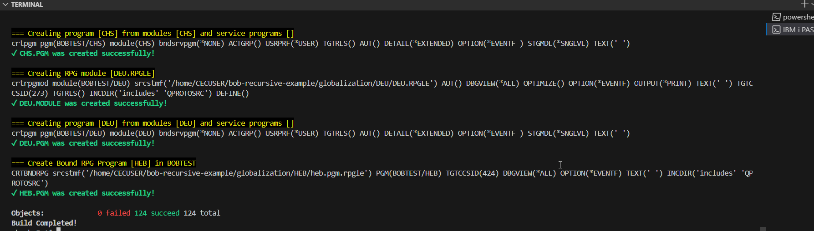

---
# Test Cases
[unit test cases](https://github.com/worksofliam/IBMiUnit)

---
# Further Research
- Pick the right tools required for the DevOps
  - Jenkins, IBMi-CI ***(new)***, GitLab Runners, etc., for CI-CD
  - Gmake or BOB for building the code
  - Usage of Source Orbit ***(new)*** to resolve dependency conflicts
  - Right tool to setup unit test cases. 
  - Migrate the Sources from Members to IFS.
  - Self hosted or cloud based VCS. I vote for Self Hosted (GitBucket)
  
*May be a **self hosted GitBucket**, running along with **Jenkins**, which triggers **Source Orbit** for builds, & uses **IBMi-CI** for building the objects (via BOB) would be an ideal setup.*