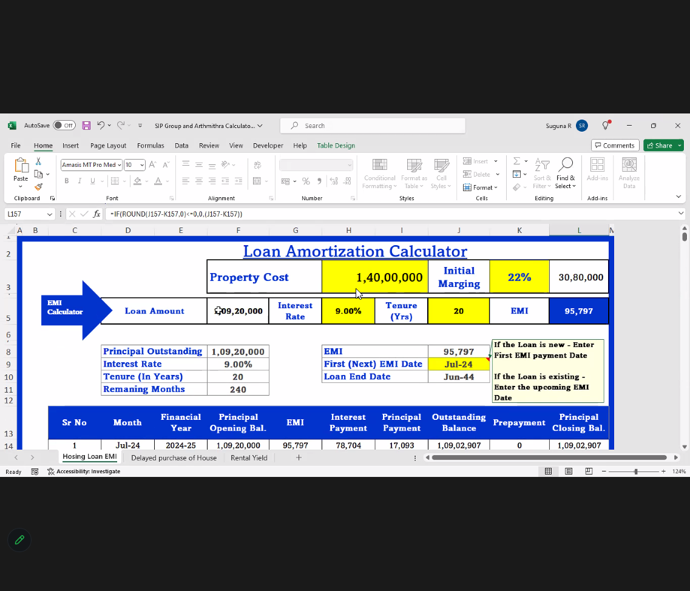
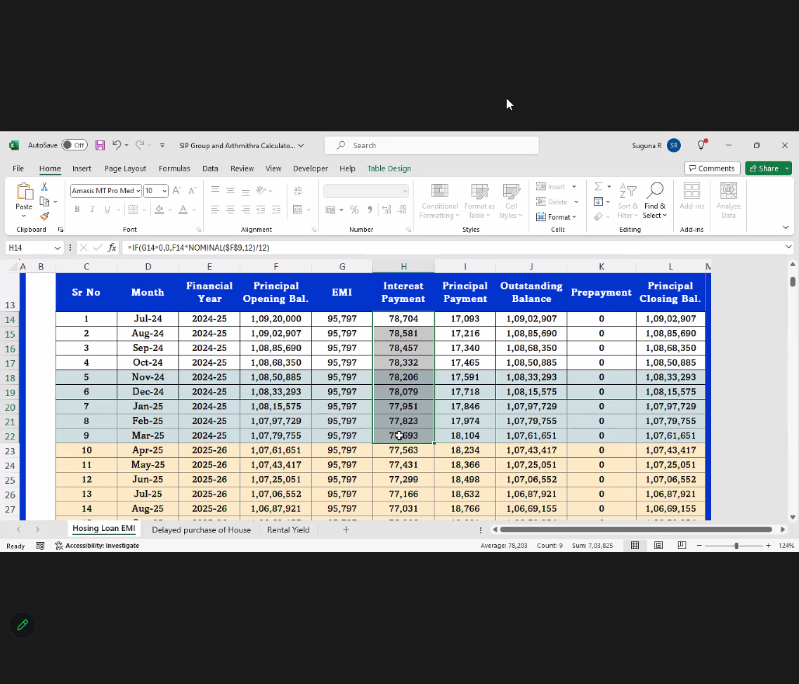
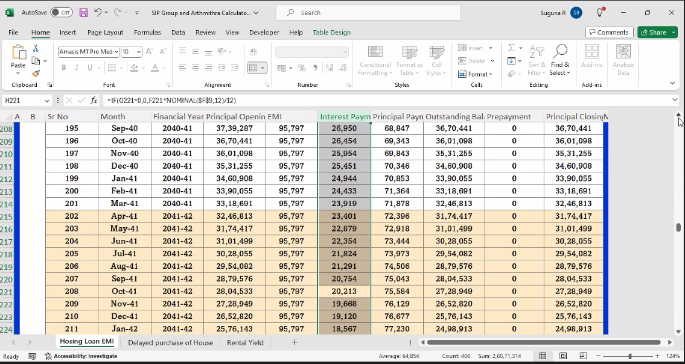
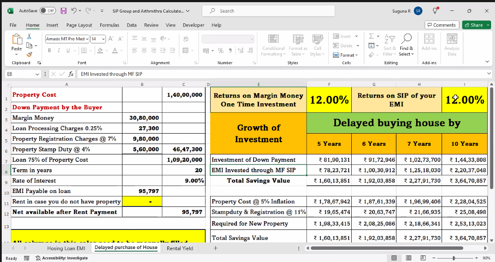
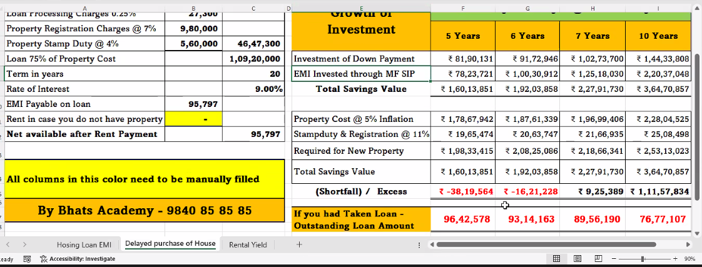

7 lakhs for Home Loan Interest till March'25

5 LPA  taxable income will be reduced. 

12 years from now 66LPA will be the outstanding charges

22k p.m SIP will give 70Lakhs at 12% C.A.G.R

EMI - 1.24L for the next twelve years.

on 20 years the SIP will give out 2.4Cr

Total EMI spent - 2.40Cr

Land Value increase (real estate) 5% increase per year
Current value is 90L.
After 20Yrs that will be 2.5Cr 

Future Planning 40k for 1 child for 20 Years
Loan SIP - 22k for 12 Years

2Cr Corpus for Wed - 18 Yrs
60L Corpus for Edu - 12.5 Yrs
7.5Cr Corpus for Retirement - 23 Yrs

Total SIP - 63000

----

Monthly Expense Limit - 80k
(Rent, EB, Transport, Child School Fee, Insurance)