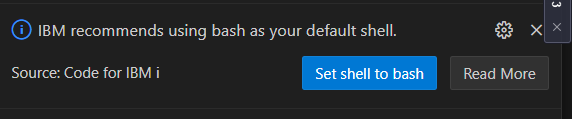

## First things first
- Connect to IBMI via VS Code. You should knew that now already. If not, check [this](https://github.com/Programmersio-IBMi/vscode-integration/blob/main/README.md) link and come back here once you have connected your IBMi.  
- Open the PASE Terminal. Enter `Ctrl + Shift + J` once connected to the IBM I via VS Code and select *PASE* terminal
### Set Shell to BASH
  Either set it via VS Code. 
  
  
  <br>
  **OR**
  <br>
Enter the below command in the PASE terminal. *Don't forget to ==replace username==*
  ```bash
  /QOpenSys/pkgs/bin/chsh -s /QOpenSys/pkgs/bin/bash username
  ```

  - **Disconnect the IBMI and reconnect again for the BASH to take effect.**
  - Once connected, open up the PASE terminal again. If the shell is set to bash successfully, you should see the below screen
  

## Set Open Source path variables
In order to be able to run the linux commands without specifying the path name, we have to setup the Open Source Path Variables. Do the below steps to do so.
- Create a new file called .profile in your home folder by issuing the command `touch .profile`
- Open the file `.profile` using VS Code's IFS Browser
  
  
- Copy paste the below content on the `.profile` file. 
```bash
PATH=/QOpenSys/pkgs/bin:$PATH
export PATH PASE_PATH
```
---

# Install GIT via YUM
`yum install git`

## Connect a remote repository
**Setup the user name and email for your local git**
  ```bash
  git config --global user.name 'Ravisankar Pandian' #To add a user name for the git application.

  git config --global user.email ravisankar.pandian@programmers.io #To add email for the git application 
  ```
**Generate a public/private keypair.**
 Enter the below command in your PASE terminal. (make sure to enter the email id that you use in your github account)
   `ssh-keygen -t ed25519 -C "ravisankar.pandian@programmers.io"`
- Hit enter again to save the key pair at the default location itself. 
- Hit enter again (no passphrase is required)
- Notice the location of the public key and open it in your VS Code. 
 

**Copy the public key**
- Navigate to the same folder in your VS Code as below and open the public key
  
  
- Copy all the contents of the file. We need to put that into our GitHub account.
  
**Create New SSH Key in your remote repository**
- Open https://github.com/settings/keys and click 'New SSH Key'. 
- Enter some title, Select the key type as "authentication key", paste the previously copied public key, and finally select 'Add SSH Key"
  
- Once added, you should see the below screen
  

**Connect to the remote repository**
- Now it is time for us to connect to a remote repo. I have setup a GitHub repository called *'gitlearn'* for this experiment and I am going to clone that. 

- You can create your own repo in your github account and copy the command to clone via SSH as below.
  

- FYI: This is the command that I just copied
`git@github.com:ravisankar-PIO/gitlearn.git`

- Go to the PASE Terminal and enter
`git clone git@github.com:ravisankar-PIO/gitlearn.git`


---

# Install Jenkins

**Download the Jenkins installation JAR file first**
Run the below commands in your PASE terminal
```bash
cd ~ 
wget http://mirrors.jenkins.io/war-stable/latest/jenkins.war
```

**Start Jenkins using the Java Command**
Jenkins can be started by using JAVA command. 

>Note1: 
The default JAVA version in IBMi sometimes would be 8. But Jenkins require version 11 and above. So we will tell IBMi to use the latest version of JAVA while running Jenkins. To do so, set up the environment variables.

>Note2:
We are setting up the Jenkins' home folder on a folder called 'jenk'. So that the whole application can be uprooted and planted in another location if required. 


```bash
export JAVA_HOME=/QOpenSys/QIBM/ProdData/JavaVM/jdk17/64bit
export JENKINS_HOME=/home/CECUSER/jenk
```
Once the environment variable is set, we can run Jenkins by issuing below command.
Notice that I am using the port# 7594
```bash
java -jar jenkins.war --httpPort=7594
```
Copy the password to your clipboard to use it later. 


**Jenkins initial setup in browser**
Head over to the browser and type in the IP address of the IBM followed by `:7594`. In my case, it is `http://129.40.94.33:7594/`. Paste the admin password that we just copied a while ago.


Remember to select "Install suggested plugins"
>Note: It will take some time to load the next screen. Don't click more than once, as it might end up in error. 


Let's create an Admin user which will be used to login to the Jenkins app from now on. 

UserName: ravi
Password: welcome
Email: ravisankar.pandian@programmers.io


```

```


----
## References and foot notes

`ADDENVVAR ENVVAR(JAVA_HOME) VALUE('/QOpenSys/QIBM/ProdData/JavaVM/jdk17/64bit') LEVEL(*SYS)`


java -Dfile.encoding=UTF-8 -jar jenkins.war --httpPort=7594


0881c3c7c38647f7bfb67009669f7b92
0881c3c7c38647f7bfb67009669f7b92
0dd39072832a4cf6aca59fa65999a942


______________
>footnotes
Refer [this](https://github.com/worksofliam/blog/issues/4) and [this](https://pm2.keymetrics.io/docs/usage/quick-start/) and [this](https://www.youtube.com/watch?v=0O2Nz5duuzg) link to automate Jenkins using PM2.

> [Getting started](https://devopscube.com/jenkins-2-tutorials-getting-started-guide/) with Jenkins.
>Create Jenkins [pipeline](https://www.jenkins.io/doc/pipeline/tour/hello-world/)

